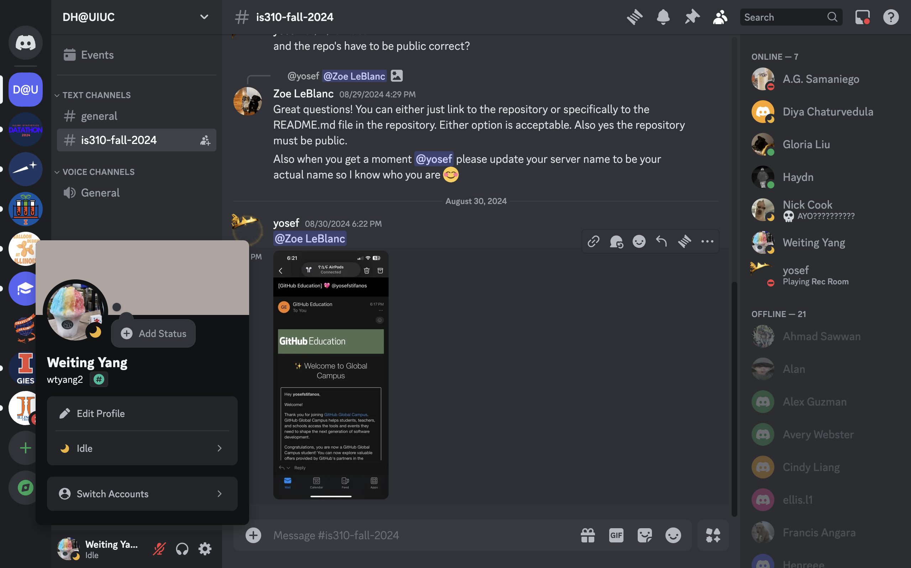
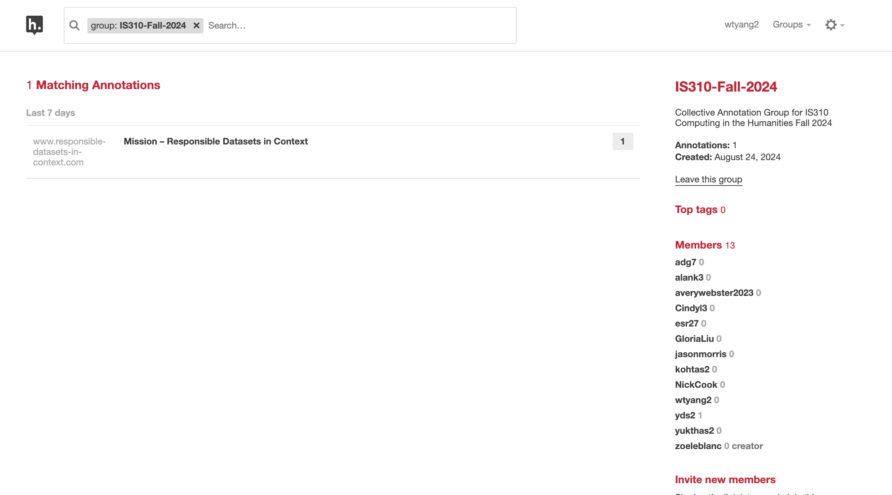
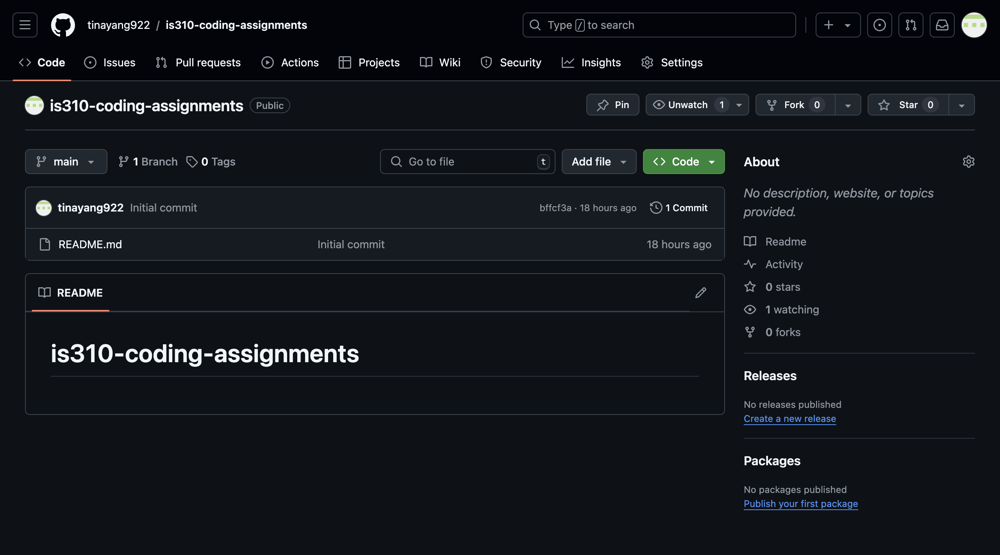
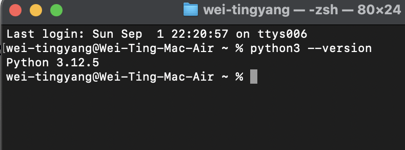
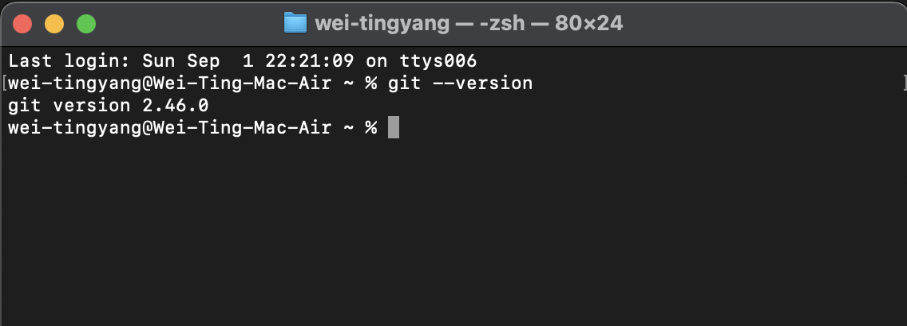
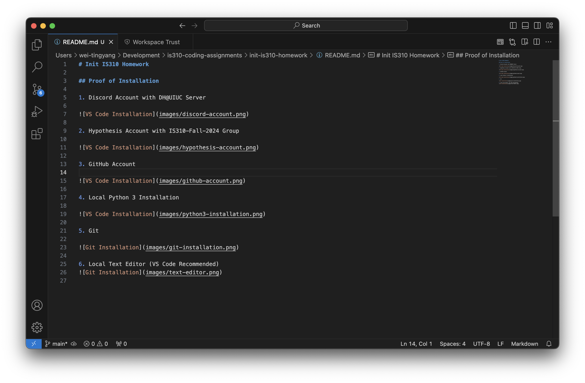

# Init IS310 Homework

## Proof of Installation

1. Discord Account with DH@UIUC Server

2. Hypothesis Account with IS310-Fall-2024 Group

3. GitHub Account

4. Local Python 3 Installation

5. Git

6. Local Text Editor (VS Code Recommended)

